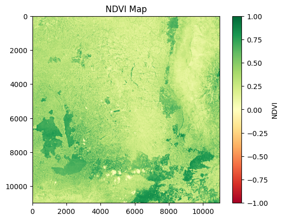

# Agri-Advisor: Sentinel-2 NDVI Crop Health Monitor
[[Open In Colab](https://colab.research.google.com/assets/colab-badge.svg)](https://colab.research.google.com/github/Srujanasri6/PROJECT-MINI/blob/main/NDVI.ipynb)

This notebook calculates crop health using satellite data.
## Output

Green = Healthy 34.2% crops | Red = Stressed areas
